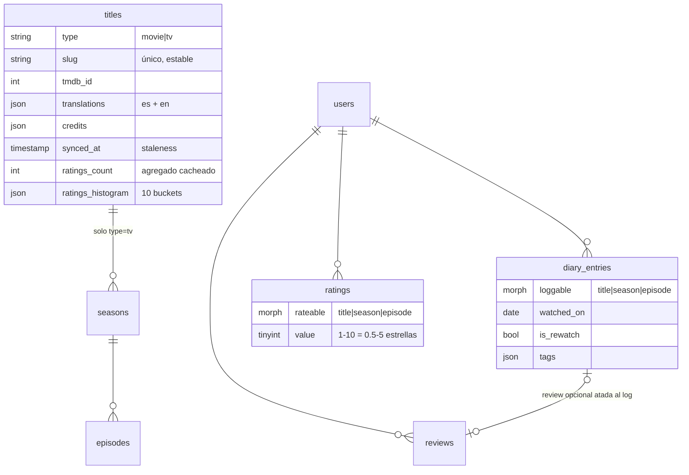

# Arquitectura de Movieboxd

Este documento explica **cómo está construido** Movieboxd y **por qué** se tomó cada decisión. Para instalación y uso, ver [README.md](README.md).

## 1. Visión general

Movieboxd es un **monolito Laravel 12 con Inertia.js 2 + Vue 3**: no hay API REST separada ni SPA independiente. Cada request pasa por un controller que devuelve una página Inertia con sus props; Vue renderiza en el cliente y las navegaciones posteriores son XHR con JSON. No se usa SSR (ver [§10](#10-frontend) para cómo se resuelve el SEO sin él).

```
Navegador ──HTTP──► Laravel (controllers) ──► Inertia props ──► Vue 3 (páginas)
                        │
                        ├─► MySQL (catálogo snapshot + datos de usuarios)
                        ├─► TMDB API (solo desde el backend, con caché)
                        └─► Cola database (refrescos, importador)
```

Decisiones estructurales de base:

| Decisión | Alternativa descartada | Motivo |
|---|---|---|
| Inertia + Vue en un monolito | API + SPA separada | Un solo deploy, auth por sesión, sin duplicar validación ni tipos |
| Admin en el mismo stack Vue/Inertia | Filament | Coherencia visual y de código; el panel es chico (4 pantallas) |
| Columna enum `role` + middleware | spatie/laravel-permission | Solo hay 2 roles fijos; un paquete de permisos es sobre-ingeniería |
| Cola y caché con driver `database` | Redis | El entorno objetivo (Laragon/Windows) no tiene Redis; el volumen no lo exige |
| App dark-only | Theming claro/oscuro | Fidelidad a Letterboxd; `:root` y `.dark` comparten la misma paleta |

## 2. Modelo de datos

### 2.1 Catálogo: tabla unificada `titles`

Películas y series viven en **una sola tabla** `titles` con columna `type` (`movie` | `tv`), en lugar de dos tablas separadas. Esto permite que watchlist, listas, favoritos, likes y búsquedas mezclen ambos tipos sin uniones ni polimorfismo extra. Las series se extienden con `seasons` y `episodes`:



### 2.2 Interacciones polimórficas

Ratings, likes, reseñas y entradas de diario apuntan a **tres niveles** (título, temporada, episodio) mediante relaciones polimórficas. Los morphs usan **alias cortos** (`title`, `season`, `episode`, `review`, `comment`, `list`, `user`) registrados con `Relation::enforceMorphMap()` en `AppServiceProvider` — nunca se serializan FQCNs en la base, así renombrar una clase PHP no rompe datos.

Tablas de trackeo: `watched_titles`, `episode_watches`, `diary_entries`, `ratings`, `likes`, `watchlist_items`, `follows`, `favorites`, `reviews`, `comments`, `reports`, `lists` + `list_items`.

### 2.3 Reglas de producto (invariantes)

Estas reglas, extraídas del comportamiento real de Letterboxd, son **invariantes del dominio** y están cubiertas por tests:

1. **Watched, rating, like, review y diario son estados independientes y combinables.** El diario es una colección de eventos fechados, no un flag booleano.
2. Rating de 0.5 a 5 estrellas en medios pasos, guardado como **entero 1–10** (evita floats en agregaciones). El like (corazón) es independiente del rating.
3. **Rewatch = nueva entrada de diario**, autodetectada si existe un log previo del mismo ítem. Cada entrada tiene su propio rating y reseña.
4. Una reseña atada a un log genera **un solo ítem** en el feed (FK opcional `reviews.diary_entry_id`).
5. **Watchlist única** por usuario; marcar como visto saca el título de la watchlist automáticamente (lo hace el observer).
6. El feed muestra **solo** entradas de diario y reseñas — nunca watched/ratings sueltos.
7. Perfil con máximo **4 favoritos** con posición.

## 3. Integración con TMDB

### 3.1 Por qué TMDB

Es la única API gratuita que cubre bien **películas y series con temporadas y episodios** (`/tv/{id}/season/{n}` devuelve todos los episodios con sinopsis, imagen, fecha y duración). Soporta español, tiene rate limit holgado (~40 req/s) y CDN de imágenes gratis; su licencia no comercial solo exige atribución. Descartadas: TVMaze (sin películas), OMDb (1.000 req/día, episodios pobres), Trakt (sin metadata rica), TheTVDB (licencia paga).

### 3.2 Proxy con caché — la key nunca sale del backend

`app/Services/Tmdb/TmdbClient.php` es el único punto de contacto con TMDB. Cachea cada respuesta (búsquedas y detalles 1 h, trending 6 h) y resuelve la API key con prioridad **setting de admin → `.env`**:

```php
Setting::get('tmdb.api_key') ?: config('services.tmdb.key')
```

La key cargada desde el panel se guarda con `Crypt::encryptString` y jamás se devuelve al navegador.

### 3.3 Import on demand + snapshot local

La búsqueda **no persiste nada**: los resultados apuntan a `/resolve/{type}/{tmdbId}`. Al hacer clic, `TitleResolverController` importa el título si es la primera vez (vía `TmdbImportService`) y redirige a su URL canónica (`/film/{slug}` o `/show/{slug}`). Ventajas:

- La base solo contiene títulos que **alguien visitó** — no se espeja el catálogo completo de TMDB.
- Toda interacción de usuario referencia una fila local con FK real, nunca un ID remoto.
- Los **episodios se importan lazy** al visitar la temporada (una sola llamada trae todos los de esa temporada).

Con `append_to_response=translations`, una única llamada trae la metadata en inglés y español, guardada en la columna JSON `translations` (trait `HasTranslations` resuelve según el locale con fallback).

### 3.4 Refresco (staleness)

Cada fila tiene `synced_at`. El comando `movieboxd:refresh-stale` (programado 04:00) encola jobs `RefreshTitle` (rate-limited a 30 req/s) para los títulos vencidos según umbral: **películas 30 días, series en emisión 24 h, series terminadas 30 días**. Así los datos de series activas (próximos episodios) se mantienen frescos sin refrescar todo el catálogo.

## 4. Ratings y agregados cacheados

### 4.1 Columnas de agregados + observers

Mostrar contadores (ratings, likes, watchlist, reviews, watched) en cada tarjeta haría `COUNT(*)` por título en cada página. En su lugar, cada título/temporada/episodio tiene **columnas de agregados** (`ratings_count`, `ratings_sum`, `ratings_histogram`, `watched_count`, `likes_count`, `watchlist_count`, `reviews_count`) mantenidas por **observers** de los modelos fuente.

Los observers **recalculan con un `GROUP BY` por escritura** en lugar de aplicar deltas (+1/−1): es una query más por operación de usuario (barato), pero es autocorrectivo — un delta perdido corrompe el contador para siempre; un recalculo no.

Dos salvaguardas adicionales:

- El comando nocturno `movieboxd:reconcile-aggregates` (04:30) recalcula **todo** desde las tablas fuente, y también se corre al final de un import masivo de Letterboxd.
- **Trampa conocida**: los borrados masivos (`Model::where(...)->delete()`) no disparan eventos de modelo, por lo que los observers no corren. Donde importa, se borra por instancia (`->first()?->delete()`).

### 4.2 Promedio ponderado

El promedio simple es engañoso con pocos votos (un título con un solo 5★ «le gana» a uno con mil 4.5★). El trait `HasRatingAggregates` implementa la fórmula bayesiana estilo IMDb:

```
WR = (v/(v+m))·R + (m/(v+m))·C
```

donde `v` = votos del título, `R` = su promedio, `C` = media global (cacheada 1 h) y `m` = votos a priori, **configurable desde el panel de admin** (setting `rating.prior`). El histograma de 10 barras se guarda como JSON de 10 buckets en la misma tabla.

## 5. Feed de actividad

`ActivityFeedService` construye el feed **derivándolo de las tablas fuente** con un `UNION ALL` sobre `diary_entries` + reseñas standalone (`diary_entry_id IS NULL`) de los usuarios seguidos, ordenado por fecha y paginado.

Se descartó la alternativa de una tabla `activities` materializada (fan-out): es más escalable pero exige mantener consistencia ante ediciones/borrados, y a esta escala la query directa con índices es más que suficiente. El diseño del UNION garantiza por construcción las reglas de producto: los watched/ratings sueltos no pueden aparecer, y un log con reseña es un único ítem.

## 6. Roles, administración y feature flags

- **Roles**: enum `role` (`user` | `admin`) en `users` + middleware `EnsureUserIsAdmin`. Deliberadamente, `role` y `banned_at` **no son mass-assignable**: se modifican solo con asignación explícita desde los controllers de admin, así un mass-assignment accidental en cualquier otro endpoint jamás puede escalar privilegios.
- **Ban con efecto inmediato**: banear borra las sesiones activas del usuario, y el middleware `EnsureUserIsNotBanned` cierra la sesión al vuelo si el flag aparece a mitad de sesión. Un admin no puede degradarse ni banearse a sí mismo.
- **Settings**: tabla `settings` clave-valor con valores sensibles encriptados (la API key de TMDB). Los **feature flags** (registro, comentarios, listas, reseñas) viven ahí, se aplican con el middleware `feature:{flag}` en las rutas y se comparten al frontend como prop Inertia para ocultar la UI correspondiente.
- **Moderación**: cualquier usuario reporta reseñas/comentarios/listas (un reporte pendiente por usuario y contenido); el admin resuelve desde una cola filtrable con «descartar» o «borrar contenido» (el borrado ajusta contadores vía observers).

## 7. Internacionalización

Dos capas coordinadas por el middleware `SetLocale` (prioridad: preferencia del usuario → sesión → `es`), con el locale compartido como prop Inertia:

- **Frontend**: vue-i18n en modo composition (`legacy: false`) con los diccionarios en `resources/js/i18n/{es,en}.ts`.
- **Backend**: laravel-lang para validaciones y mails, más `lang/{es,en}/app.php` para mensajes flash propios.
- **Datos**: la metadata de TMDB se guarda en ambos idiomas en la columna `translations` (ver §3.3), así el cambio de idioma no requiere nuevas llamadas a la API.

## 8. Importador de Letterboxd

Convierte la exportación oficial de Letterboxd (ZIP, formato v7) en datos del usuario. Es el subsistema con más movimiento asíncrono:

```
POST /settings/import (ZIP + casillas de sección)
        │  valida: mimes:zip, máx. 50 MB, un import activo por usuario
        ▼
PrepareLetterboxdImport (job, timeout 300 s)
        │  abre el ZIP (ZipArchive), localiza los CSV por sufijo de ruta
        │  parsea con fgetcsv (reseñas multilínea), deduplica diary/reviews
        │  agrega TODO por película única (name|year) → letterboxd_import_items
        ▼
ProcessLetterboxdImport (job auto-encadenado, timeout 120 s)
        │  procesa 20 ítems pendientes por corrida:
        │    matching TMDB → import del título → aplicación idempotente del payload
        │  actualiza processed/matched y SE RE-DESPACHA si quedan pendientes
        ▼
finalize(): crea las listas, corre reconcile-aggregates,
            marca completed y borra el ZIP
```

Decisiones clave:

- **Un ítem = una película única** con su payload agregado (watched, rating, like, watchlist, entradas de diario, posiciones en listas). Así cada película se matchea contra TMDB **una sola vez** aunque aparezca en cinco CSV.
- **Job auto-encadenado en tandas de 20** en lugar de un job por ítem o batches de Laravel: procesamiento secuencial (auto-limitado contra la API de TMDB), resumible tras un deploy o crash (los ítems tienen estado propio), y sin tabla de batches.
- **Matching en tres niveles**: `searchMovie(nombre, año)` → sin año con tolerancia ±1 → `searchMulti` aceptando TV (miniseries que Letterboxd trata como películas). Sin match → el ítem queda `unmatched` con razón y aparece en el reporte de la página.
- **Política de conflictos: conservar siempre lo existente.** Todo se aplica con `firstOrCreate`; un rating del export nunca pisa uno propio; la watchlist no se aplica sobre títulos ya vistos; el diario deduplica por usuario + ítem + fecha. Re-ejecutar el import completo es **idempotente**.
- **Progreso en vivo** sin websockets: la página usa `usePoll` de Inertia (2,5 s, solo mientras hay un import activo) recargando únicamente las props `imports` y `hasActiveImport`.
- No importable por diseño: `comments.csv` y `likes/{reviews,lists}.csv` referencian contenido que solo existe en Letterboxd; `deleted/` y `orphaned/` se ignoran.

## 9. Listas

`lists` + `list_items` con slug único por usuario, toggle ranqueada, visibilidad pública/privada (403 para terceros) y nota por ítem. El reordenamiento por drag & drop (vuedraggable) persiste con una validación defensiva: el endpoint `reorder` rechaza sets de ítems que no coincidan exactamente con los de la lista, y al quitar un ítem se resecuencian las posiciones para que nunca haya huecos.

## 10. Frontend

- **Layouts**: `AppLayout` (header con búsqueda y menú, footer con la atribución obligatoria a TMDB), `AdminLayout` y el layout de settings.
- **Componentes centrales**: `LogModal` (fecha, estrellas, corazón, reseña, spoilers, tags, rewatch autodetectado — un solo POST atómico a `/log`), `ActionsPanel` (ojo/corazón/reloj + estrellas + favorito + agregar a lista), `RatingStars` (medios pasos según la posición del mouse), `RatingHistogram`, `PosterCard`, `EmptyState`.
- **Deferred props de Inertia 2** para lo costoso no crítico (reseñas populares, estadísticas del perfil): la página renderiza al instante y esas secciones llegan después, con skeletons de la misma geometría que el contenido final.
- **SEO / Open Graph sin SSR**: los crawlers no ejecutan JS, así que el `<Head>` de Inertia no les sirve. Cada página con entidad propia pasa una prop `meta` (armada con `app/Support/PageMeta.php`) que **`app.blade.php` renderiza server-side** como `og:title`, `og:description`, `og:image`, `og:type` y `twitter:card`. Es el 95 % del beneficio del SSR con el 5 % de su complejidad.
- **Estética**: paleta extraída del CSS real de Letterboxd como tokens Tailwind `lb-*` — fondo `#14181C`, superficies `#2C3440`/`#283038`, texto `#9AB`, y los tres acentos semánticos: verde `#00E054` (visto), naranja `#FF8000` (me gusta), azul `#40BCF4` (watchlist). Tipografías Inter (UI) y Lora (prosa de reseñas). Los gráficos de estadísticas usan una sola serie con el verde validado por contraste (≥3:1 sobre la superficie).

## 11. Testing

- **Suite Feature-first**: 98 tests (506 assertions) que ejercitan el stack completo vía HTTP + `assertInertia`, en vez de tests unitarios de cada clase.
- **SQLite en memoria** para velocidad, MySQL en producción. Regla de portabilidad derivada: `YEAR()` no existe en SQLite → usar `SUBSTR(fecha, 1, 4)` en `selectRaw`/`groupBy` (`whereYear` sí es portable). Aplicado en el diario y las estadísticas por año.
- **`Http::fake()` siempre**: ningún test golpea la API real de TMDB. Los fakes rutean por path y query param para simular búsquedas y detalles.
- El importador se testea con un **ZIP real construido en el test** (ZipArchive) que reproduce los casos difíciles del formato: carpeta raíz, reseña multilínea entrecomillada, entrada duplicada entre `diary.csv` y `reviews.csv`, película sin match y carpeta `deleted/` a ignorar. Con `queue.default=sync`, la cadena completa de jobs corre inline dentro del test.

## 12. Extensiones futuras consideradas

No planificadas, pero el diseño las contempla: normalizar `titles.credits` (JSON) a tablas `people` para páginas de actor/director; filtros por década/género en `/films` y `/shows`; notificaciones; watch providers de TMDB (requiere atribución adicional a JustWatch). Ver la lista completa en [PROYECTO.md](PROYECTO.md).
